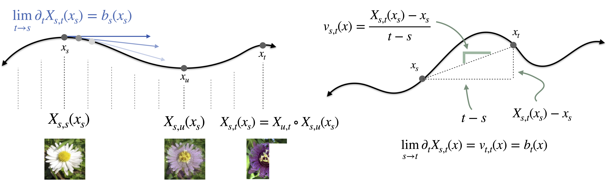

# How to build a consistency model

[](https://neurips.cc/)
[](https://arxiv.org/abs/2505.18825)
[](https://www.python.org/downloads/)
[](https://github.com/google/jax)



**Official repository for "How to build a consistency model: Learning flow maps via self-distillation" (NeurIPS 2025).** https://arxiv.org/abs/2505.18825

by Nicholas M. Boffi (CMU), Michael Albergo (Harvard), and Eric Vanden-Eijnden (Courant Institute of Mathematical Sciences, Capital Fund Management)

Project Page: https://flow-maps.github.io

## Background

Flow maps are a new class of generative models that generalize consistency models, enabling the generation of samples in just one or a few forward passes of the learned network. 

This work introduces a unified mathematical framework for their design, revealing that existing approaches (consistency models, consistency trajectory models, shortcut models) are all particular cases of a broader design space. 

With this insight in hand, we present three direct training algorithms based on a notion of *self-distillation*, in which the flow map distills an implicit flow to eliminate dependence on a pre-trained teacher. We prove their connections to existing methods and show that a new **Lagrangian Self-Distillation (LSD)** approach delivers superior performance and training stability in practice.


## What this paper does

### 1. Unifies the theory of consistency models

We show that the **tangent condition** -- a simple differential relation between the flow map and its underlying velocity field -- yields three equivalent characterizations of the flow map. This approach exposes the full design space of training objectives and clarifies their properties both theoretically and in practice. Existing methods for accelerated generative modeling emerge as particular points in this space, showing, for example, that shortcut models and consistency models estimate the same underlying object.

### 2. Introduces three training algorithms

From our characterizations, we derive three self-distillation methods:

- **Lagrangian Self-Distillation (LSD)** -- An approach that matches the time derivative of the flow map to its underlying implicit flow.
- **Progressive Self-Distillation (PSD)** -- An approach that uses the current estimate of the flow map itself to bootstrap smaller steps into larger steps. We show that this reduces to shortcut models in a particular case.
- **Eulerian Self-Distillation (ESD)** -- An approach that learns the flow map by minimizing the squared residual of a certain partial differential equation. We show that this reduces to consistency training for consistency models and consistency trajectory models as a particular case.

### 3. Empirical analysis

We perform a comprehensive experimental comparison of LSD, PSD, and ESD across CIFAR-10, CelebA-64, AFHQ-64, and a two-dimensional synthetic dataset. Our findings reveal that:

- **ESD** exhibits training instability due to the spatial Jacobian and temporal derivatives appearing in its objective, particularly at higher resolutions, necessitating careful training schemes and hyperparameter tuning.
- **PSD** avoids spatial and temporal derivatives, leading to excellent training stability, but suffers from compounding errors that degrade sample quality and reduce performance.
- **LSD** avoids spatial Jacobians and bootstrapping from small steps, leading to stable training without compounding errors and achieving the highest-quality samples on all problems studied.

## Installation

### Requirements
- Python 3.9+
- CUDA 11.8+ or 12.0+

### Setup

**1. Clone and create environment**
```bash
git clone https://github.com/nmboffi/flow-maps.git
cd flow-maps
conda create -n flowmaps python=3.9
conda activate flowmaps
```

**2. Install JAX** for your CUDA version:
```bash
# CUDA 12.x
pip install --upgrade "jax[cuda12_pip]" -f https://storage.googleapis.com/jax-releases/jax_cuda_releases.html

# CUDA 11.8
pip install --upgrade "jax[cuda11_pip]" -f https://storage.googleapis.com/jax-releases/jax_cuda_releases.html

# CPU only
pip install --upgrade jax
```

**3. Install dependencies**
```bash
pip install \
    flax==0.8.2 \
    optax==0.2.2 \
    ml_collections==0.1.1 \
    tensorflow==2.15.0 \
    tensorflow-datasets==4.9.4 \
    wandb==0.16.5 \
    matplotlib==3.7.0 \
    seaborn==0.12.2 \
    scipy==1.10.1 \
    click==8.1.7 \
    requests==2.31.0 \
    tqdm==4.65.0
```

**4. Verify**
```bash
python -c "import jax; print(f'JAX {jax.__version__} | Devices: {jax.devices()}')"
```


## Quick start

### Training

```bash
python py/launchers/learn.py \
    --cfg_path configs.cifar10 \
    --slurm_id 0 \
    --dataset_location /path/to/datasets \
    --output_folder /path/to/outputs

# Other datasets
python py/launchers/learn.py --cfg_path configs.celeba64 --slurm_id 0
python py/launchers/learn.py --cfg_path configs.afhq64 --slurm_id 0
python py/launchers/learn.py --cfg_path configs.checker --slurm_id 0
python py/launchers/learn.py --cfg_path configs.four_gaussians --slurm_id 0
python py/launchers/learn.py \
    --cfg_path configs.schiebinger_lsd \
    --slurm_id 0 \
    --dataset_location ~/Desktop/schiebinger \
    --schiebinger_n_pcs 5 \
    --schiebinger_train_times 0,3,6,9,12,15,18 \
    --output_folder /path/to/outputs

# Create the compact HVG-PCA dataset (change --n-pcs as needed).
python scripts/create_schiebinger_hvg_pca.py --n-pcs 5

# Optional: prepare its all-days evaluation classifier independently.
python scripts/train_schiebinger_celltype_classifiers.py --all-days --n-pcs 5

# CITE or Multi, training on three timepoints and evaluating the omitted day.
python scripts/train_cite_multi_celltype_classifiers.py

python py/launchers/learn.py \
    --cfg_path configs.cite_multi_pca100 \
    --slurm_id 3 \
    --dataset_name cite \
    --heldout_day 4 \
    --output_folder /path/to/outputs
```

For `configs.cite_multi_pca100`, `--dataset_name` is `cite` or `multi` and
`--heldout_day` is `3` or `4`. Its IDs mirror the Maizels experiment: 0 is
vanilla flow matching, 1 vanilla flow map, 2 prior-filtered flow matching, 3
prior-filtered flow map, 4 prior-filtered constrained flow map, 5 masked-OT
prior-filtered flow map, and 6 its differentiably constrained counterpart.
The classifier script makes a stratified 90/10 train/validation split, selects
the lowest-validation-loss checkpoint, and writes three `.pt`/`.npz` pairs per
dataset under `cite-classifiers/` and `multi-classifiers/`: `all_days`,
`except_day3`, and `except_day4`. The flow config automatically uses the
matching `except_day*` classifier for pair filtering and lineage losses, while
the `all_days` classifier is reserved for evaluation. This prevents the held-out
day from leaking into flow training. A matching `*_loss_curve.png` showing the
training and validation losses is saved beside every checkpoint pair. The
script's automatic device selection uses CUDA when available and CPU otherwise;
MPS remains available explicitly but is not selected automatically because its
BatchNorm running statistics can become unstable in this workload.

Schiebinger classifier checkpoints are stored in `schiebinger_classifiers/`.
The all-days classifier is reserved for evaluation. At Schiebinger flow startup,
`learn.py` creates it if absent and, only for a slurm ID that enables
endpoint-interpolant filtering or a lineage constraint loss, also creates a
second classifier trained on exactly the selected `--schiebinger_train_times`.
Existing `.npz` exports are reused without PyTorch (the corresponding `.pt`
file is optional at runtime), and a file lock prevents concurrent
jobs with the same schedule from training the same model twice. Set
`SCHIEBINGER_CLASSIFIER_PYTHON` if the flow-training Python has no PyTorch; the
launcher otherwise discovers the usual sibling `mfm_env`, `torchcfm`, or
`maizels2023aa` Conda environment. The device and training budget can be
overridden with `SCHIEBINGER_CLASSIFIER_DEVICE`,
`SCHIEBINGER_CLASSIFIER_MAX_EPOCHS`, and
`SCHIEBINGER_CLASSIFIER_PATIENCE`.
The PCA dimension is selected with `--schiebinger_n_pcs` and defaults to 5.
Directory-based dataset resolution then uses the matching
`schiebinger_serum_serum_hvg1479_pca<N>.h5ad`; an explicit H5AD path can also
be supplied. Classifier filenames include both `hvg1479` and `pca<N>`, so
models trained in different coordinate systems cannot be confused.

The config looks for the downloaded H5ADs under `~/Desktop/flow-maps-data`;
use `CITE_MULTI_DATA_DIR` or `--dataset_location` to override the data directory.
Use `--classifier_path` to override the observed-days training classifier and
`--full_data_classifier_path` to override the all-days evaluation classifier.
On every Maizels visual/distribution evaluation step it also logs
`mfm/test_EMD` in a separate W&B pane, using MFM's original predecessor-day,
100-step Euler, full-population exact-EMD test protocol. It additionally logs
`mfm/test_EMD_flowmap` after composing 100 learned flow-map steps over the same
interval. Both schedules follow `logging.visual_freq` by default. CITE/Multi
uses the same 90/10 retained-day split as MFM. These metrics require POT;
`logging.mfm.max_points = 0` means the full populations, while a positive value
enables a cheaper deterministic cap. The Euclidean transport cost makes these
metrics empirical W1, not W2.

The PCA100 CITE/Multi configurations in `metric-flow-matching/` additionally
score MFM's full day-2-to-day-7 Euler trajectories with the corresponding
`cite-classifiers/*_all_days.pt` or `multi-classifiers/*_all_days.pt` model and
the CITE/Multi-specific lineage graph. They report the shared
`final_eval/full_data_classifier/euler_invalid_trajectory_pct` metric from the
best validation-loss checkpoint, alongside `test_EMD`/`mfm/test_EMD` and
`final_eval/euler_mean_rbf_mmd2`.

Run a resumable Maizels hyperparameter grid with:

```bash
python scripts/sweep_maizels_hparams.py \
    --slurm-id 3 \
    --dataset-location /path/to/Maizels2023aa
```

The default grid uses the `D3,D3.8,D8` training schedule and minimizes mean EMD
at the held-out validation times `D3.4,D6`. Each setting runs with seeds
`0,1,2`; change them with `--seeds`. Learning rate is always swept, while
constraint and entropy weights are added only for variants that use them.
Per-seed results go to
`outputs/maizels_hparam_sweep/slurm_<id>_results.csv`; across-seed means and
standard deviations go to the corresponding `slurm_<id>_summary.csv`.
Completed runs are skipped when the command is resumed. Override the grids with
`--learning-rates`, `--constraint-weights`, and `--entropy-weights`.

For CITE/Multi, `ot`/`ot_plain` and `ot_endpoint_interpolant` use fresh exact
minibatch OT couplings during training. The OT size tracks
`optimization.bs`; because each optimizer batch is balanced across two retained
intervals, each OT problem uses half of that batch (for example, 64 cells when
`optimization.bs = 128`). The latter mode applies the cell-type endpoint and classifier-checked
interpolant rules as a hard transport mask. If those rules make balanced
transport infeasible, it uses maximum-valid-mass partial assignment and samples
only from the valid portion.

Maizels OT modes retain the cached full-population coupling by default. Pass
`--maizels_ot_coupling minibatch_ot` (or set
`MAIZELS_OT_COUPLING=minibatch_ot`) to recompute an exact coupling for every
training batch instead. With the default batch size this is one 128-by-128
D3-to-D8 problem per step. This backend matches the CITE/Multi convention and
uses raw squared-Euclidean PCA distances without feature standardization.

Maizels distribution evaluation uses the same exact uniform-mass EMD as
`mfm/test_EMD`: Euclidean ground cost solved with POT (that is, empirical W1,
not sliced W2). It is logged for each intermediate day and averaged under
`distribution_eval/*_emd_mean` during training and for the selected best model.
The default pushes all D3 source cells and compares them with up to 1,024 cells
from each intermediate day; set `distribution_eval_points_per_time = 0` for
uncapped target populations.

Maizels model trajectory-violation metrics use held-out D3 cells for both
periodic and final logging. Sampling is without replacement: if
`trajectory_eval_source_max_points` exceeds the held-out population, every
held-out D3 cell is evaluated exactly once.

Run all seven CITE/Multi methods over a seed grid with:

```bash
SEEDS="1 2 3" DATASETS="cite multi" HELDOUT_DAYS="3 4" \
  ./cite_multi_pca100_sweep.sh
```

The defaults shown above produce 60 runs. Any grid axis can be restricted, for
example `DATASETS=cite HELDOUT_DAYS=4 SLURM_IDS="0 1"`. Set `DRY_RUN=1` to
print and validate the commands without launching training.

The algorithm can be selected via `slurm_id`, which can also be used to run all experiments simultaneously with a slurm job array:

| ID | Algorithm |
|----|-----------|
| 0 | LSD |
| 1 | PSD-uniform |
| 2 | PSD-midpoint |
| 3 | ESD |

### Evaluation

```bash
# Compute FID
python py/launchers/calc_dataset_fid_stats.py --dataset cifar10 --out cifar10_stats.npz
python py/launchers/sample_and_calc_fid.py \
    --cfg_path configs.cifar10 \
    --checkpoint checkpoints/model.pkl \
    --stats cifar10_stats.npz \
    --n_steps 1

# Evaluate Schiebinger held-out intermediate time points
python py/launchers/eval_schiebinger_heldout.py \
    --cfg_path configs.schiebinger_lsd \
    --slurm_id 0 \
    --dataset_location ~/Desktop/schiebinger \
    --schiebinger_n_pcs 5 \
    --schiebinger_train_times 0,3,6,9,12,15,18 \
    --checkpoint /path/to/outputs/schiebinger_pca5_lsd_25.pkl \
    --out_dir /path/to/outputs/schiebinger_eval

# Evaluate the single omitted CITE/Multi day from a saved checkpoint.
python py/launchers/eval_maizels_heldout.py \
    --cfg_path configs.cite_multi_pca100 \
    --slurm_id 3 \
    --dataset_name cite \
    --heldout_day 4 \
    --checkpoint /path/to/checkpoint.pkl \
    --out_dir /path/to/outputs/cite_holdout_day4
```


## Datasets and reproducibility
Experiments on the following datasets can be run with the included code:

- **CIFAR-10**: Auto-downloaded via TensorFlow Datasets.
- **CelebA-64**: Auto-downloaded via TensorFlow Datasets; pre-processed via cropping in included code.
- **Checker**: Generated on-the-fly.
- **Four Gaussians**: Generated on-the-fly with paired interpolant endpoints
  constrained to A -> D and C -> B.
- **AFHQ-64**: You'll need to manually download this via [HuggingFace](https://huggingface.co/datasets/huggan/AFHQv2) and crop to 64x64.
- **Schiebinger (reprogramming)**: Defaults to
  `~/Desktop/schiebinger/schiebinger_serum_serum_hvg1479_pca5.h5ad`. Generate
  it from the original H5AD with `scripts/create_schiebinger_hvg_pca.py`; it
  retains the 1,479 supplied highly variable genes and stores the requested
  PCA coordinates. Select the dimension with `--schiebinger_n_pcs` (default 5)
  and training observations with
  `--schiebinger_train_times`; the earliest and latest selected days define the
  experiment window. Every omitted observation inside that window is reserved
  for evaluation, and observations outside it are ignored. The lineage prior
  constrains only `MEF/other -> MET`, `MET -> IPS`, and
  `MEF/other -> Stromal`. Epithelial,
  Trophoblast, and Neural transitions are deliberately unconstrained. Required
  classifiers are trained and cached automatically before flow training. A
  selected-day classifier must still contain at least two examples of every
  cell type: for example, the endpoint-only `0,18` schedule contains no MET
  cells and therefore cannot support classifier-dependent variants without
  leaking an evaluation day. Prior-free IDs 0, 1, and 7 can use that schedule.

Code to download and process AFHQ is included in ``notebooks/download_afhq.ipynb``. Each experiment reported in the paper can be exactly reproduced by using one of the included configuration files.


## Multi-GPU training
This codebase is written for single-node, multi-GPU training. JAX automatically uses all visible GPUs:

```bash
# Use all GPUs
python py/launchers/learn.py --cfg_path configs.cifar10 --slurm_id 0

# Restrict to specific GPUs
CUDA_VISIBLE_DEVICES=0,1,2,3 python py/launchers/learn.py --cfg_path configs.cifar10 --slurm_id 0
```


## SLURM cluster deployment

For large-scale experiments, SLURM batch scripts are provided in `slurm_scripts/`:

```bash
# Submit all 4 experiments as array job
sbatch slurm_scripts/cifar10.sbatch
sbatch slurm_scripts/celeba.sbatch
sbatch slurm_scripts/afhq64.sbatch
sbatch slurm_scripts/checker.sbatch

# FID computation for trained models
sbatch slurm_scripts/cifar10_fid.sbatch
sbatch slurm_scripts/celeba_fid.sbatch
sbatch slurm_scripts/afhq64_fid.sbatch
```

**Important**: These scripts are configured for our specific cluster (FASRC at Harvard). You will need to modify:
- Account/partition names (`#SBATCH --account`, `#SBATCH --partition`)
- Module loading commands (`module load`)
- Conda environment paths and activation
- Dataset and output directory paths
- Time limits and memory requirements based on your hardware

The array job structure (`--array=0-3`) runs all 4 experiments (LSD, PSD-uniform, PSD-midpoint, ESD) in parallel.


## Weights & Biases logging

This codebase uses [Weights & Biases](https://wandb.ai) for experiment tracking and visualization.

### Setup

1. **Create a WandB account** at [wandb.ai](https://wandb.ai)

2. **Login** on your machine:
```bash
wandb login
```

3. **Configure your entity**: Set an environment variable with your WandB username:
```bash
export WANDB_ENTITY="your-username"
```

### Disabling WandB

To train without WandB logging:
```bash
export WANDB_MODE=offline
python py/launchers/learn.py --cfg_path configs.cifar10 --slurm_id 0
```

Or disable completely:
```bash
export WANDB_DISABLED=true
python py/launchers/learn.py --cfg_path configs.cifar10 --slurm_id 0
```

### Logging structure

- **Project**: Experiments log to the project specified in config (default: `self-distill-flow-maps`)
- **Run names**: Automatically generated from dataset, loss type, and hyperparameters
- **Metrics logged**:
  - Training loss (total, diagonal, off-diagonal components)
  - FID scores at multiple sampling steps (1, 2, 4, 8, 16)
  - Learning rate, gradient norms
  - Sample visualizations every 5k steps

Probably have to run `export WANDB_ENTITY="harryamad-university-of-cambridge"` in terminal to get wandb access.

## Project structure

```
flow-maps/
├── py/
│   ├── configs/              # Experiment configs (cifar10.py, celeba64.py, etc.)
│   ├── common/
│   │   ├── losses.py         # LSD, PSD, ESD implementations
│   │   ├── flow_map.py       # Flow map wrappers
│   │   ├── edm2_net.py       # EDM2 UNet architecture
│   │   ├── interpolant.py    # Stochastic interpolants
│   │   ├── datasets.py       # Dataset loading and preprocessing
│   │   ├── fid_utils.py      # FID computation and Inception network
│   │   ├── state_utils.py    # EMA training state management
│   │   ├── dist_utils.py     # Multi-GPU distributed utilities
│   │   ├── loss_args.py      # Loss function arguments and sampling
│   │   ├── logging.py        # Training logging and visualization
│   │   ├── network_utils.py  # Network initialization helpers
│   │   └── updates.py        # Optimizer and learning rate schedules
│   └── launchers/
│       ├── learn.py                   # Main training script
│       ├── sample_and_calc_fid.py     # Generate samples and compute FID
│       ├── calc_dataset_fid_stats.py  # Compute dataset statistics for FID
│       └── eval_schiebinger_heldout.py # Held-out time-point evaluation for Schiebinger
├── notebooks/                         # Jupyter notebooks for figure generation
```


## Citation

If you found this repository useful or the associated paper interesting, please consider citing:

```bibtex
@misc{boffi2025buildconsistencymodellearning,
      title={How to build a consistency model: Learning flow maps via self-distillation},
      author={Nicholas M. Boffi and Michael S. Albergo and Eric Vanden-Eijnden},
      year={2025},
      eprint={2505.18825},
      archivePrefix={arXiv},
      primaryClass={cs.LG},
      url={https://arxiv.org/abs/2505.18825},
}

@misc{boffi2025flowmapmatchingstochastic,
  title={Flow map matching with stochastic interpolants: A mathematical framework for consistency models},
  author={Nicholas M. Boffi and Michael S. Albergo and Eric Vanden-Eijnden},
  year={2025},
  eprint={2406.07507},
  archivePrefix={arXiv},
  primaryClass={cs.LG},
  url={https://arxiv.org/abs/2406.07507},
}
```


## License

This code is distributed under the MIT License.
