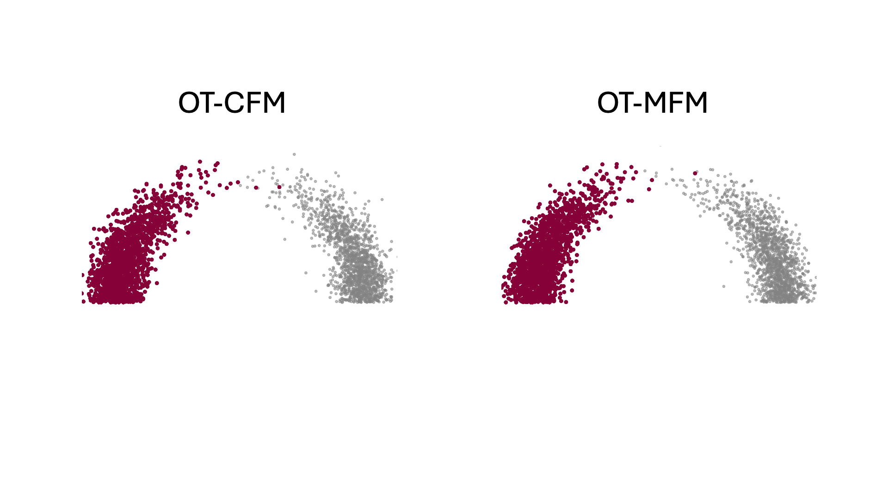

# [Metric Flow Matching for Smooth Interpolations on the Data Manifold](https://arxiv.org/abs/2405.14780)

<div align="center">

[](https://arxiv.org/abs/2405.14780)
[](https://x.com/KKapusniak1/status/1797632928920564014)

</div>

<div align="center">
    <p align="center">
        
    </p>
</div>

## Installation

To set up the environment, you need to install the required dependencies. You can do this by using the `requirements.txt` file.

```bash
conda create --name myenv python=3.11
conda activate myenv
pip install -r requirements.txt
```

## Datasets

Please download the following datasets to run the experiments.

- **Lidar**: [Link to Lidar dataset](https://github.com/facebookresearch/generalized-schrodinger-bridge-matching?tab=readme-ov-file)
- **Single Cell**:
  - CITE and Multi: [Link to CITE and Multi datasets](https://data.mendeley.com/datasets/hhny5ff7yj/1)
  - EB: [Link to EB dataset](https://github.com/KrishnaswamyLab/TrajectoryNet/tree/master/data)
- **Animal Faces HQ (AFHQ)**: [Link to AFHQ dataset](https://github.com/clovaai/stargan-v2#animal-faces-hq-dataset-afhq)

## Running Experiments

All hyperparameters used for the experiments in the paper are located in the [`config`](./configs) folder, with specific definitions in [`mfm/train/parsers.py`](./mfm/train/parsers.py). To specify the data location, use the `--working_dir` flag. 

To specify the experiment to run use `--config_path` flag, for example:

```bash
python -m mfm.train.main --config_path ./configs/arch/ot-mfm.yaml
```


## Evaluation

For the `arch`, `sphere`, `single cell`, and `images` experiments, evaluation metrics will be logged after training. Plots for `arch`, `lidar`, and `sphere` will also be saved at the end of training in the `--working_dir` folder.

Model checkpoints are saved within the `checkpoints` folder under `--working_dir`. The `geopath` model can be loaded using the `--load_geopath_model_ckpt <checkpoint_path>` flag. Training and evaluation can be resumed from a flow model checkpoint using the `--resume_flow_model_ckpt <checkpoint_path>` flag.

### Maizels PCA50 endpoint experiments

The Maizels integration follows the flow-map experiment protocol: it trains only
on D3 -> D8 pairs and evaluates the learned velocity rollout against every
intermediate day. The CITE-50 MFM architecture and metric defaults are used,
with 10,000 optimizer steps each for geopath and flow training.

```bash
python -m mfm.train.main \
  --config_path configs/single_cell/50dims/mfm_maizels.yaml \
  --working_dir /path/to/output \
  --maizels_dataset_path /path/to/celltype_classification_pca50_dataset.csv.gz \
  --maizels_classifier_path /path/to/celltype_classifier_pca50.pt \
  --maizels_pair_mode none
```

Available pair modes are:

- `none`: independent D3/D8 coupling;
- `ot_plain`: exact OT without biological filtering;
- `endpoint_interpolant`: learn the geopath from independent pairs, then filter
  independent candidates by endpoint lineage and 50 classifier checks along
  the frozen learned geodesic before velocity-field training;
- `ot_endpoint_interpolant`: learn the geopath from plain OT pairs, then solve
  OT on endpoint-compatible edges whose frozen learned geodesics pass the same
  classifier checks.

The biological pair prior therefore does not affect metric or geopath fitting;
it is introduced only when constructing the velocity-training pair pool.
If the learned-geodesic edge mask cannot support uniform balanced marginals,
MFM uses maximum-valid-mass partial OT: no rejected edge is restored, and the
largest transportable valid mass is renormalized for velocity training.

The Maizels runs log to `self-distill-flow-maps`, including all intermediate-day
RBF MMD and sliced-Wasserstein metrics, classifier-invalid Euler trajectory
percentage, PC1/PC2 plots, and the common loss/gradient/learning-rate scalars.

On Apple Silicon, the metric/geopath phase automatically uses CPU because the
higher-order `torch.func.jvp` backward used by the time-conditioned geopath is
not supported by PyTorch MPS. The subsequent velocity-field phase still uses
the configured GPU/MPS accelerator.


## Citation

If you find this repository helpful for your publications, please consider citing our paper:
```
@article{kapusniak2024metric,
  title={Metric Flow Matching for Smooth Interpolations on the Data Manifold},
  author={Kapusniak, Kacper and Potaptchik, Peter and Reu, Teodora and Zhang, Leo and Tong, Alexander and Bronstein, Michael and Bose, Avishek Joey and Di Giovanni, Francesco},
  journal={arXiv preprint arXiv:2405.14780},
  year={2024}
}
```

## Files Structure
```
mfm
├── dataloaders
│   ├── image_data.py
│   ├── lidar_data.py
│   └── trajectory_data.py
├── flow_matchers
│   ├── ema.py
│   ├── eval_utils.py
│   ├── flow_net_train.py
│   ├── geopath_net_train.py
│   └── models
│       └── mfm.py
├── geo_metrics
│   ├── land.py
│   ├── metric_factory.py
│   └── rbf.py
├── networks
│   ├── flow_networks
│   │   └── mlp.py
│   ├── geopath_networks
│   │   ├── mlp.py
│   │   └── unet.py
│   ├── mlp_base.py
│   ├── unet_base.py
│   └── utils.py
├── train
│   ├── main.py
│   ├── parsers.py
│   └── train_utils.py
└── utils.py
```
